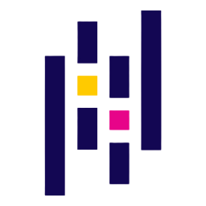
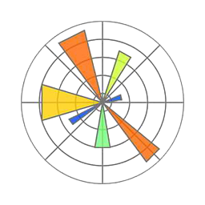
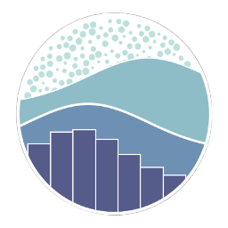
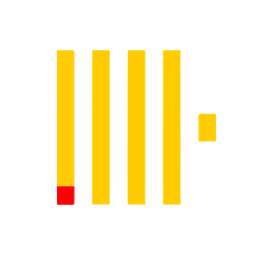

<h1 align="left">Описание</h1>

Меня зовут Николай и я аналитик данных из Казахстана, г. Алматы с коммерческим опытом более 1 года. Принес огромную ценность для международных компаний благодаря проактивному исследовательскому анализу. Готов принести выгоду и вам!

<h2 align="left">Области анализа</h2>

1. Продуктовая аналитика (A/B тесты, продуктовые гипотезы)
2. Финансы (инвестиции, банковские операции, управленческая отчетность)
3. Продажи (FMCG)

<h2 align="left">Мои проекты</h2>

1. [Анализ рынка видеоигр 1985-2017 г.](https://github.com/nikolay-sevastyanov/video_game_sales)
2. [Case-study финансовых показателей McDonalds 2002-2022г.](https://github.com/nikolay-sevastyanov/mc_fin)
3. [Изучение оттока клиентов в телекоммуникационной компании](https://github.com/nikolay-sevastyanov/telco_churn_prediction)
4. [A/B тестирование - изменение экрана покупки](https://github.com/nikolay-sevastyanov/purchase_button_ab_test)
5. [Data-pipeline погодных данных](https://github.com/nikolay-sevastyanov/16_day_weather_data_layer)

<h2 align="left">Мои инструменты</h2>

  
  
  
  
  
  
  
  
  
  
  
  
  
  
  
  
  
  
  
  
  
  
  
  
  
  
  
  
  
  
  
  
  

