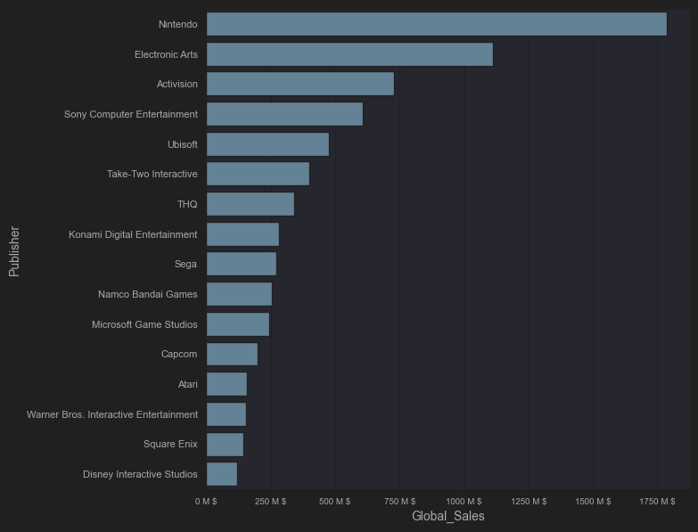
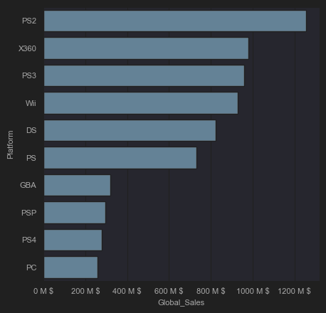

# Мои Проекты
## 1. Анализ продаж кофе в кофейне 2024-2025г.
### Датасет: [Coffee Sales](https://www.kaggle.com/datasets/ihelon/coffee-sales)
### Инструменты: Python, Pandas, Seaborn

### Ключевые бизнес-инсайты:
 1. Сезонность:  <br>  <br>
   a. По времени, клиенты предпочитают посещать кофейню в 7:00 либо между 16:00 и 22:00.  <br> <br>
    <br> <br>
   b. По дням недели, пик посещения приходит на понедельник, вторник и субботу. Воскресение - день с самым низким потоком клиентов. <br> <br>
    <br> <br>
   c. По месяцам, самое "ходовое" время происходит на осень - август-ноябрь, и конец зимы - февраль. В январе и июле происходит минимум продаж кофейных напитков. <br> <br>
    <br> <br>
 3. Предпочтения клиентов: <br>  <br>
   a. Самые популярные кофейные напитки: американо, каппучино, американо с молоком, латте <br> <br>
     <br> <br>
   b. С апреля по сентябрь происходит "кофеинный сезон" - 90% продаж кофейных напитков это напитки для того чтобы "взбодриться" - американо, эспрессо, кортадо, а 10% продаж - сладкие, согревающие напитки: латте, каппучино, горячий шоколад, горячий милкшейк.  С октября по март происходит "сезон согревания" - отношение "кофеинных" к "согревающим" уже составляет 80% к 20%.  <br> <br>
    <br> <br>
   с. В масштабах года, 84% продаж - "кофеинные" напитки, 14% - "согревающие" напитки, 1% - кофейные напитки с добавлением алкоголя, 1% - другое.  <br> <br>
    <br> <br>


### Предложения для бизнеса:
 1. Краткосрочные подработки для сотрудников на периоды высокой загруженности для помощи основному персоналу.
 2. Создание более "теплой" атмосферы осенью, в остальное время создание "рабочей" атмосферы для привлечения наиболее активных клиентов в текущий сезон.
 3. Пересмотр меню кофейных напитков: исключить либо сильно сократить закуп алкоголя и других напитков для оптимизации складского пространства, заполняя его более ходовыми предложениями.

## 2. Анализ рынка видео-игр 1980-2017г.  <br>
### Датасет: [Video Game Sales](https://www.kaggle.com/datasets/gregorut/videogamesales) <br> 
### Инструменты: Python, Pandas, Seaborn

### Ключевые бизнес-инсайты: <br> <br>
 1. Издатель Nintendo является ключевым игроком на рынке платных видео-игр с общей суммой мировых продаж за 1980-2017г. - 1, 7 млрд $ <br> <br>
  <br> <br>
 2. Издатели Electronic Arts, Activision, Sony Computer Entertainment и Ubisoft совокупно собрали общую сумму мировых продаж в 2,9 млрд $, оставаясь крупными игроками на рынке платных видео-игр <br> <br>
  <br> <br>
 3. Наиболее популярные жанры видео-игр за 1980-2017г. - экшн, спорт и шутер. <br> <br>
  <br> <br>
 4. Игры на консолях PS1, PS2, PS3, XBOX360, Nintendo DS и Wii за 1980-2017г. принесли издателям наибольшее кол-во денег. <br> <br>
  <br> <br>
 5. Пик продаж платных видео-игр наблюдался в 2008-2010 годах, далее рынок пошел на спад до сегодняшнего дня. <br> <br>
  <br> <br>
 6. Nintendo, Sony и Activision за 2000-2015г. показывали наиболее стабильные годовые продажи видео-игр в среднем от 50 млн. $ . <br> <br>
  <br> <br>
 7. Пики продаж игр на консоли происходят в первые 5 лет после ее выхода. <br> <br>
  <br> <br>
 8. Только на PC и Nintendo DS игры выходят более 30 лет после появления этих платформ <br> <br>
  <br> <br>
 9. В Японии, Америке и Европе самым успешным издателем 1980-2025г. была Nintendo. В других регионах - Electronic Arts. <br> <br>
 ```
NA_Sales max
    Publisher   NA_Sales   EU_Sales   JP_Sales  Other_Sales  Global_Sales  TotalMarketCap%
360  Nintendo  816869996  418739997  455419999     95329999    1786559997               20
----------------------------------------------------------------------------------------------------
EU_Sales max
    Publisher   NA_Sales   EU_Sales   JP_Sales  Other_Sales  Global_Sales  TotalMarketCap%
360  Nintendo  816869996  418739997  455419999     95329999    1786559997               20
----------------------------------------------------------------------------------------------------
JP_Sales max
    Publisher   NA_Sales   EU_Sales   JP_Sales  Other_Sales  Global_Sales  TotalMarketCap%
360  Nintendo  816869996  418739997  455419999     95329999    1786559997               20
----------------------------------------------------------------------------------------------------
Other_Sales max
           Publisher   NA_Sales   EU_Sales  JP_Sales  Other_Sales  Global_Sales  TotalMarketCap%
139  Electronic Arts  595069993  371270000  14040000    129769999    1110319993               12
----------------------------------------------------------------------------------------------------
Global_Sales max
    Publisher   NA_Sales   EU_Sales   JP_Sales  Other_Sales  Global_Sales  TotalMarketCap%
360  Nintendo  816869996  418739997  455419999     95329999    1786559997               20
```
 10. За 1980-2017 г. во всем мире, кроме Японии, самым прибыльным жанром видео-игр оставлся экшн. В Японии же самый прибыльный жанр - RPG. <br> <br>
 <br> <br>
 11. Перспективным жанром для видеоигр после 2015 года является RPG. Стабильно 50% рынка занимают экшн и спорт. <br> <br>
 <br> <br> 
 12. Спрос на жанры видео-игр имеет сугубо глобальный характер, не считая Японию, где отличие их рынка - высокий спрос на RPG. <br> <br>
 <br> <br>
 <br> <br>
 <br> <br>
 <br> <br>
 <br> <br>
 
### Предложения для бизнеса:
  1. Издателям и разработчикам игр следует обращать внимание на действие Nintendo, EA. Ubisoft, Sony, Activision. Если есть коммерческая цель занять определенную нишу на рынке, можно обращать внимание на те области рынка, которые они не занимают либо постепенно теряют долю.
  2. В долгосрочной перспективе, издателям и разработчикам следует делать игры на PC для стабильных продаж. (DS убрали с продаж в 2011г.)

  4. Рынок платных видеоигр сильно сузился в 2015 по сравнению с 2010 - более 50% спада. Инвесторам следует больше обратить внимания на другие отрасли, например мобильные игры, ММО либо игры формата Free to Play.

## 3. Анализ финансовой отчетности McDonalds LLC 2002-2022 г.
### Датасет: [McDonald's Financial Statements](https://www.kaggle.com/datasets/mikhail1681/mcdonalds-financial-statements-2002-2022)
### Инструменты: PostgreSQL, PowerBI <br> <br>
 <br> <br>
### Ключевые бизнес-инсайты:
1. Рост капитализации акций McDonalds, несмотря не кризисы и нарушения цепочек поставок, продолжает идти стабильно, 20 млрд $ в год. (за  20 лет капитализация увеличилась почти в 10 раз). Mcdonalds продолжает быть стабильным источником роста инвестиционного портфеля и прибыли.
2. с 2008 по 2017 г. компания держала доходность по дивидендам в районе 3%. В остальное время она оставалась (и остается) ниже 2%.
3. Операционная маржинальность McDonalds с 2010 г. и по 2022 г. держалась (и держится) выше 25%. Можно определенно сделать вывод что эта компания не поддерживается полностью инвестиционным капиталом и может оперировать за счет прибыли.
4. В 2014 году компания McDonalds решила взять на себя большую долговую нагрузку, о чем говорит p/b ratio (отношение рыночной капитализации компании к её балансовой стоимости), а также суммы чистых активов и задолженности. Отношение обязательств к чистым активам изменилось с 1/1 на 9/1. Для общего понимания рынка следует изучить те факторы, которые привели к такой ситуации. <br>

### Предложения для бизнеса: (по юр. причинам - не совет об инвестициях)
1. Mcdonalds продолжает быть стабильным источником роста инвестиционного портфеля и прибыли.
2. Услуги (товары) компании высокомаржинальны, фундамент в виде прибыли построен.
3. Отношение обязательств к чистым активам в 2014 г. изменилось с 1/1 на 9/1.
<br>
Исходя из этих фактов, инвесторам стоит изучить факторы изменения финансовой стратегии компании в 2014 г., и на основе этих выводов принимать решение о вложениях в нее. В краткосрочной перспективе эта ценная бумага является не очень привлекательной, но все может выравниться в течение 5 лет.

## 4. Анализ отзывов к фильмам на IMDB (словестный анализ)
### Датасет: [IMDB Dataset of 50K Movie Reviews](https://www.kaggle.com/datasets/lakshmi25npathi/imdb-dataset-of-50k-movie-reviews)
### Инструменты: Python, Pandas, Matplotlib, Squarify
### Ключевые инсайты: (представляющие наибольший интерес) <br> <br>
1. Чем реже встречается слово, тем больше оно тяготеет либо к резко негативным, либо к очень позитивным отзывам. <br> <br>
2. Группы слов: <br> <br>
 а. Слова: **"a" , "both", "own", "real", "bit", "many", "cast"** имеют позитивную эмоциональную окраску 52-59% упоминаний в позитивных отзывах. <br>
 b. Слова: **"his", "her", "she"** имеют позитивную эмоциональную окраску - 52-59% упоминаний в позитивных отзывах <br>
 c. Слова: **"gives", 'DVD", "each", "our", "often", "become"** имеют позитивную эмоциональную окраску - 57-65% упоминаний в позитивных отзывах. <br> <br>
 d. Слова: **"they" , "because", "there"** имеют негативную окраску - 42-44% упоминаний в позитивных отзывах. (все остальные - негативные) <br>
 e. Слова: **"i'm", "thing", "movie", "director", "look", "do"** , "and" имеют негативную эмоциональную окраску - 38-45% упоминаний в позитивных отзывах. <br>
 f. Слова: **"money", "minutes", "reason", "guy", "camera, "script"** имеют резко негативную эмоциональную окраску - 29-40% упоминаний в позитивных отзывах. <br>
 
## 5. Анализ продаж авокадо в США 2015-2018 года
### Датасет: [Avocado Prices and Sales Volume 2015-2023](https://www.kaggle.com/datasets/vakhariapujan/avocado-prices-and-sales-volume-2015-2023)
### Инструменты: Excel
### Ключевые инсайты:  <br>
1. Рынок авокадо а также эта компание имеет хороший потенциал роста от 10% в год, если верить 2016-2017 годам.
2. Регионы США, потребляющие авокадо более чем на 1 млрд $ за 3 года: West, California, South Central
3. Обычно сезон продаж авокадо начинается с янкаря по июль. Месячные продажи увеличиваются до ~30 млн $ в месяц, по сравнению со вторым полугодием - ~20 млн $ в месяц.
4. Рынок "organic" авокадо составляет 1/40 часть от рынка обычных авокадо (2.5%). "Organic"  авокадо почти никто не интересуется.
5. Клиенты больше предпочитают маленькие упаковки авокадо. Отношение продаж маленьких/средних/больших упаковок составляет: 60%/35%/5%. Большими упаковками почти никто не интересуется.
6. Клиенты предпочитают авокадо типа PLU 4046 и PLU 4225, нежели PLU 47702. Отношение их продаж: 48%/48%/4%

### Предложения для бизнеса:

1. Следует проконсультироваться с торговыми представителями городов для изучения локальной сезонности продаж и устранения резких перекосов оборота.
2. PLU 47702, organic авокадо и авокадо в больших упаковках имеет смысл сделать продуктами привлечения клиентов, а не продуктами для прибыли, для того чтобы в конечном итоге спрос на другие авокадо тоже повышался.
3. Во втором полугодии имеет смысл подключать поддерживающие рекламные кампании для сглаживания спада спроса на авокадо.
